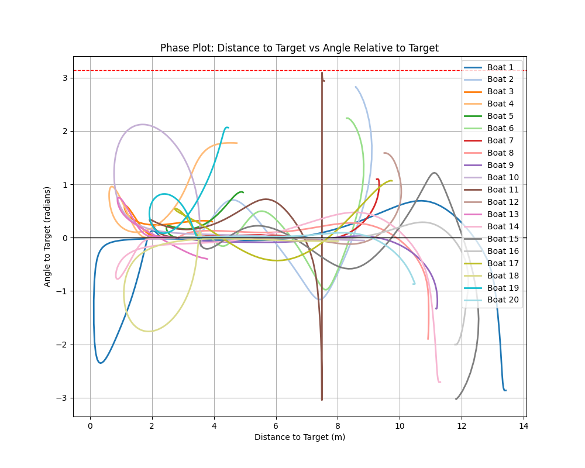
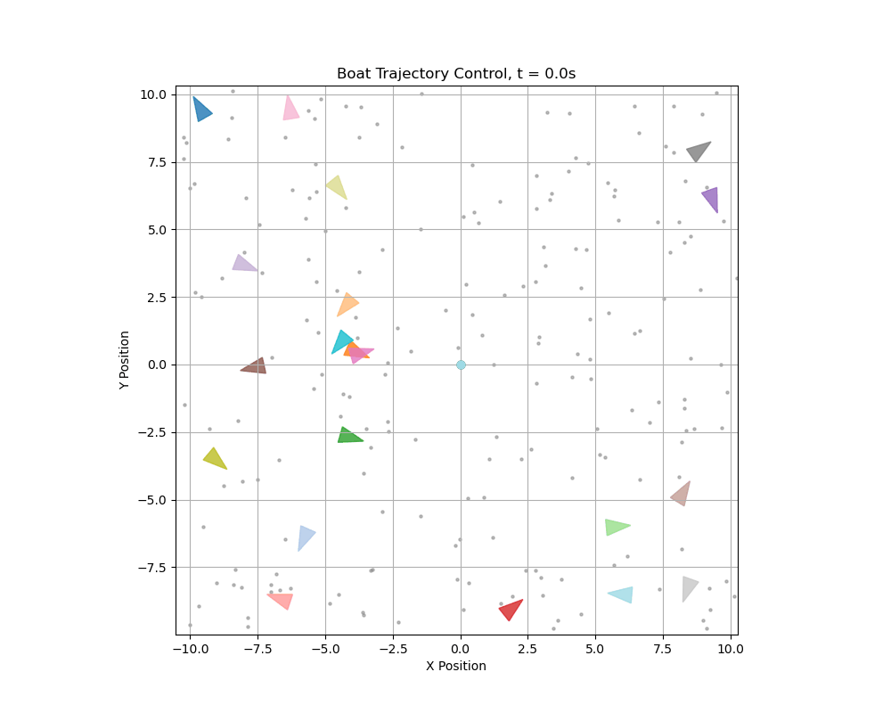
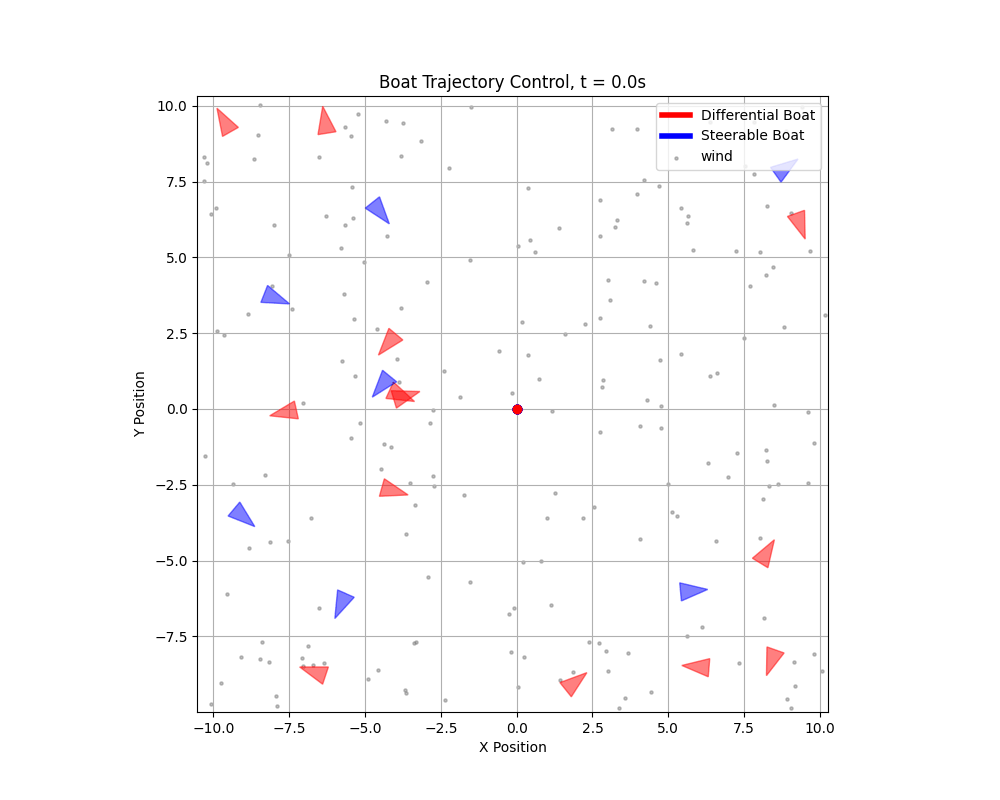
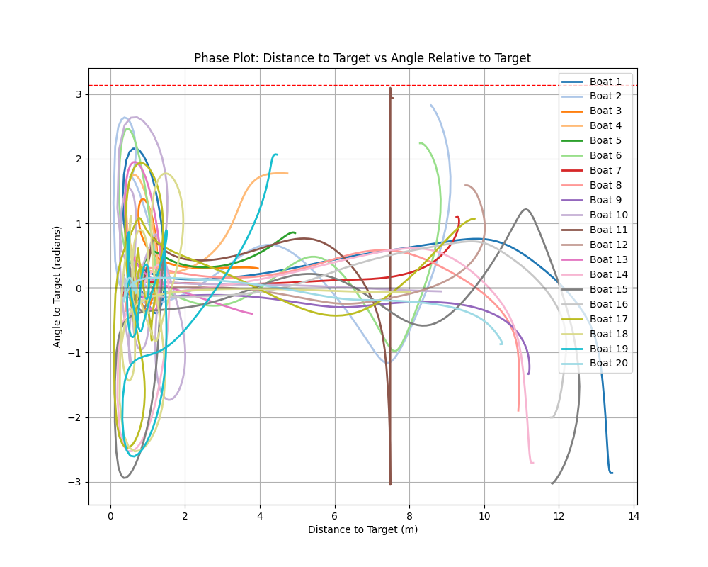
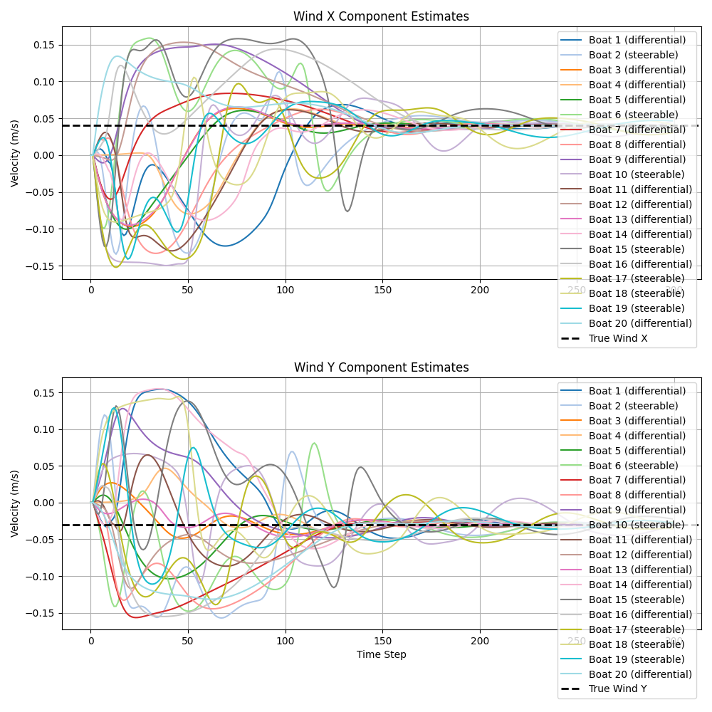
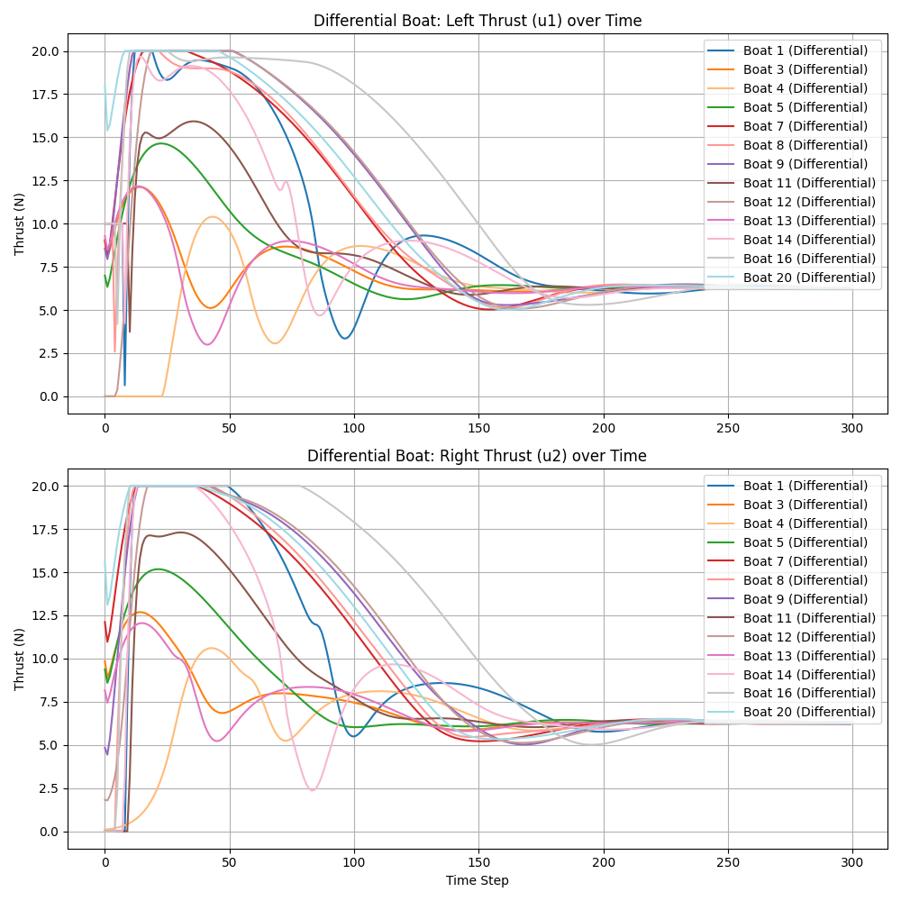
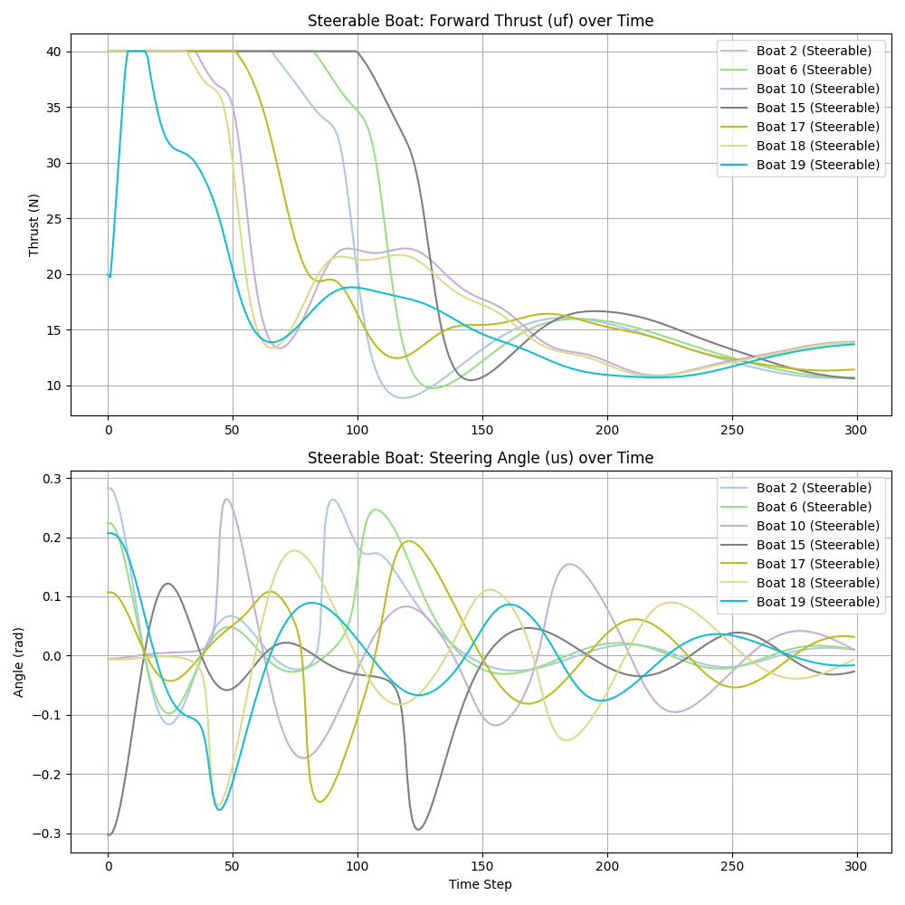

# Advanced Control: Motorized Vessel Control with Wind disturbance

## Overview

This project is focused on the **control** of a motorized boat using adaptive-based control under wind disturbance.


## Task Definition

Given the initial state $\mathbf{x}_i$ and a desired position $\mathbf{x}_d$, the goal is to design a control law $\mathbf{u} = [u_1, u_2]^T$ such that the boat will reach the desired position with zero velocity, despite wind disturbances.
The boat can finish at any angle. The thruster force can only be applied in the forward direction.

## Mathematical Model

### Boat Kinematics

Let the state vector of the boat be represented as:

$$
\mathbf{x} = \begin{bmatrix} x, & y, & \psi, & V_x, & V_y, & \omega \end{bmatrix}^T,
$$

where:

- $x, y$ are the position coordinates,
- $\psi$ is the yaw (heading),
- $V_x, V_y$ are the surge and sway velocities (linear velocities in the body-fixed frame),
- $\omega$ is the yaw rate.

#### Wind Disturbance (Simplified)

Wind is modeled as a **constant global velocity** $(V_{wx}, V_{wy})$ added to the boat’s kinematics:

$$
\begin{aligned}
\dot{x} &= V_x \cos(\psi) - V_y \sin(\psi) + V_{wx}, \\
\dot{y} &= V_x \sin(\psi) + V_y \cos(\psi) + V_{wy}.
\end{aligned}
$$

### Dynamics with Wind Disturbance  

The equations of the dynamics of the boat including wind effects have the following matrix form:

$$
\begin{bmatrix}
    \dot{x} \\
    \dot{y} \\
    \dot{\psi} \\
    \dot{V}_x \\
    \dot{V}_y \\
    \dot{\omega}
\end{bmatrix}
= \begin{bmatrix}
0 & 0 & 0 & \cos(\psi) & -\sin(\psi) & 0 \\
0 & 0 & 0 & \sin(\psi) & \cos(\psi) & 0 \\
0 & 0 & 0 & 0 & 0 & 1 \\
0 & 0 & 0 & -D_x & 0 & 0 \\
0 & 0 & 0 & 0 & -D_y & 0 \\
0 & 0 & 0 & 0 & 0 & -D_ψ
\end{bmatrix}
\begin{bmatrix}
    x \\
    y \\
    \psi \\
    V_x \\
    V_y \\
    \omega
\end{bmatrix} +
\begin{bmatrix}
0 & 0 & 0 \\
0 & 0 & 0 \\
0 & 0 & 0 \\
\frac{1}{m} & 0 & 0 \\
0 & \frac{1}{m} & 0 \\
0 & 0 & \frac{1}{I_z}
\end{bmatrix}
\begin{bmatrix}
F_x(u) \\
F_y(u) \\
M(u)
\end{bmatrix} +
\begin{bmatrix}
Vwx \\
Vwy \\
0   \\
0   \\
0   \\
0
\end{bmatrix}
$$

where:

- $m$ is the boat's mass,
- $I_z$ is the moment of inertia about the vertical axis,
- $D_x, D_y, D_\psi$ are the damping coefficients,
- $F_x, F_y$ are the forces due to the thrusters,
- $M$ is the moment generated by the thrusters, and
- $V_{wx}$ and $V_{wy}$ are wind velocities.

#### Differential Drive Boat

$$
\begin{aligned}
F_x(u) &= u_1 + u_2\\
F_y(u) &= 0 \\
M(u) &= L(u_1 - u_2)
\end{aligned}
$$

where:

- $u_1$ and $u_2$ are the control inputs for the left and right motors, respectively.
- $L$ is the distance between the motor and the center of the boat.

#### Steerable Drive Boat

$$
\begin{aligned}
F_x(u) &= u_f \cos(u_\phi)\\
F_y(u) &= u_f \sin(u_\phi)\\
M(u) &= L \cdot u_f \sin(u_\phi)
\end{aligned}
$$

where:

- $u_f$ is the control for the motor.
- $u_\phi$ is the control for the steering angle.
- $L$ is the distance between the motor and the center of the boat.

## Control Design

### Previous Energy-Based Control

In the previous project, we developed an energy-based control strategy for motorized boats, using Lyapunov stability theory.

#### **Differential Drive Boat**

The control law for differential drive is derived from an energy function combining position and orientation errors:

$$
E = \frac{1}{2} k_0 (x_e^2 + y_e^2) + \frac{1}{2} k_1 (V_x^2 + V_y^2) + \frac{1}{2} k_2 \psi_e^2,
$$

where:

- $x_e = x - x_d$, $y_e = y - y_d$ are position errors in body frame,
- $\psi_e = \psi - \psi_d$ is the heading error (though $\psi_d$ is arbitrary here),
- $k_0, k_1, k_2$ are positive gains.

Taking the time derivative and substituting dynamics, we obtain the control inputs:

$$
\begin{aligned}
u_1 &= k_0 x_e - k_1 (x_e V_x + y_e V_y - \omega) - k_2 \psi_e, \\
u_2 &= k_0 x_e - k_1 (x_e V_x + y_e V_y + \omega) + k_2 \psi_e.
\end{aligned}
$$

**Implementation Notes:**

1. **Clipping**: Thrusters are unidirectional, so inputs are saturated:

$$
u_1 = \text{clip}(0, u_1, u_{max}), \quad u_2 = \text{clip}(0, u_2, u_{max}).
$$

2. **Turn-around Case**: If both $u_1, u_2 < 0$, the boat must reverse direction. We enforce:

$$
\text{If } u_1 < 0 \text{ and } u_2 < 0, \quad \text{set } u_1 = \frac{1}{2} u_{max}, u_2 = 0 \text{ (or vice versa)}.
$$


#### **Steerable Drive Boat**

For steerable thrusters, the energy function is the same:

$$
E = \frac{1}{2} k_0 (x_e^2 + y_e^2) + \frac{1}{2} k_1 (V_x^2 + V_y^2) + \frac{1}{2} k_2 \psi_e^2.
$$

The resulting control laws:

$$
\begin{aligned}
u_f &= k_0 (x_e^2 + y_e^2) - k_1 (x_e V_x + y_e V_y), \\
u_\phi &= k_2 \psi_e,
\end{aligned}
$$

where $u_f$ is the thrust magnitude and $u_\phi$ the steering angle.

**Implementation Notes:**

1. **Clipping**:

$$
u_f = \text{clip}(0, u_f, u_{f Max}), \quad u_\phi = \text{clip}(-u_{\phi Max}, u_\phi, u_{\phi Max}).
$$

### Old energy-based control with wind:

As we can see the energy-based control that assumes zero wind cannot provide good control to reach zero position.


### Phase plot



### Adaptive Control

To handle unknown wind disturbances $(V_{wx}, V_{wy})$, we augment the energy-based controller with an adaptation law that estimates and compensates for the wind effects during the work.

#### **1. State Augmentation**

Define the **augmented state vector** to include wind disturbance estimates:

$$
\mathbf{x_a} = \begin{bmatrix} x, y, \psi, V_x, V_y, \omega, \hat{V_{wx}}, \hat{V_{wy}} \end{bmatrix}^T,
$$

where $\hat{V_{wx}}, \hat{V_{wy}}$ are estimates of the wind velocities in global frame.

The **main challenges** was to handle the different coordinates systems, as wind given in global coordinates, but boat velocities in local boat frame.

#### **2. Modified Lyapunov Function**  

Introduce a Lyapunov function including estimation errors:

$$
E_a = E + \frac{1}{2 \gamma_w} \tilde{V_{wx}}^2 + \frac{1}{2 \gamma_w} \tilde{V_{wy}}^2,
$$

where:

- $\gamma_x, \gamma_y > 0$ are adaptation gains.
- $\tilde{V_{wx}} = V_{wx} - \hat{V_{wx}}$ and $\tilde{V_{wy}} = V_{wy} - \hat{V_{wy}}$ are estimation errors.

#### **3. Adaptation Laws**

Derive adaptation laws by ensuring $\dot{E}_a \leq 0$:

$$
\begin{aligned}
\dot{\hat{V_{wx}}} &= - \gamma_w \left( \hat{V_{wx}} + V_{xGlobal} \right), \\
\dot{\hat{V_{wy}}} &= - \gamma_w \left( \hat{V_{wy}} + V_{yGlobal} \right).
\end{aligned}
$$

where:
- $V_{xGlobal}$ and $V_{yGlobal}$ are boat speed in global coordinates:

$$
\begin{aligned}
V_{xGlobal} &= \cos(\psi) V_x - \sin(\psi) V_y, \\
V_{yGlobal} &= \sin(\psi) V_x + \cos(\psi) V_y.
\end{aligned}
$$

#### **4. Adaptive Control Laws**

**Differential Drive:**

$$
\begin{aligned}
u_1 &= k_0 x_e - k_1 \left( x_e (V_x - \hat{V_{wxLocal}}) + y_e (V_y - \hat{V_{wyLocal}}) - \omega \right) - k_2 \psi_e - k_w \hat{V_{wxLocal}}, \\
u_2 &= k_0 x_e - k_1 \left( x_e (V_x - \hat{V_{wxLocal}}) + y_e (V_y - \hat{V_{wyLocal}}) + \omega \right) + k_2 \psi_e - k_w \hat{V_{wxLocal}}.
\end{aligned}
$$

**Steerable Drive:**

$$
\begin{aligned}
u_f &= k_0 (x_e^2 + y_e^2) - k_1 \left( x_e (V_x - \hat{V_{wxLocal}}) + y_e (V_y - \hat{V_{wyLocal}}) \right) - k_w \hat{V_{wxLocal}}, \\
u_\phi &= k_2 \psi_e.
\end{aligned}
$$

**where:**
- $\hat{V_{wxLocal}}$ and $\hat{V_{wyLocal}}$ are estimated wind in the boat frame:

$$
\begin{aligned}
\hat{V_{wxLocal}} &=  \cos(\psi) \dot{\hat{V_{wx}}} + \sin(\psi) \dot{\hat{V_{wy}}}, \\
\hat{V_{wyLocal}} &= -\sin(\psi) \dot{\hat{V_{wx}}} + \cos(\psi) \dot{\hat{V_{wy}}}.
\end{aligned}
$$

## Repository Structure

### `control.py`

This file contains the `Controller` classes for **Differential** and **Steering** boats, which computes the control inputs based on the boat state, desired state.

### `boat.py`

This file contains two boat classes `DifferentialThrustBoat` and `SteerableThrustBoat` that models boat dynamics, given the current control inputs.

### `visualization.py`

This module provides functions to visualize the boat trajectory and desired position.
The visualization has three modes: 'gif', 'realtime', 'final'. The 'gif' mode generates a GIF of the boat motion, 'realtime' shows the simulation in real-time, and 'final' displays the final trajectory after the simulation.

### `main.py`

The `main.py` file is the entry point for the simulation. It initializes the boat, sets up the controller, and runs the simulation loop. At each time step, the control inputs are computed, and the boat state is updated. The trajectory is then visualized.

## How to Run

To run the simulation, simply execute the `main.py` file:

```bash
python main.py
```

## Simulation Setup

### Initial Conditions

- **Initial state ($\mathbf{x}_i$)**:

$$
\mathbf{x_a} = \begin{bmatrix} x, y, \psi, V_x, V_y, \omega, \hat{V_{wx}}, \hat{V_{wy}} \end{bmatrix}^T,
$$

- We have randomly generated 20 differential/steering boats. Each board has zero initial speeds. The initial position and yaw (heading) are arbitrary.

- **Wind disturbance estimates**: The initial estimates for wind velocities $\hat{V_{wx}}$ and $\hat{V_{wy}}$ are initialized to zero.

- **The desired reference trajectory** for each boat is defined by a target position $x_d, y_d$ for convinients every target position were set to origin of the coordinate system.

- **Simulation duration**: The simulation runs for a total time of $T = 300$ seconds, with a time step $\Delta t = 1$ second.

## Results

## Adaptive control

### First iteration of adding wind estimation




### Successfull implementation

We can see that adaptive control can successfully adapt to the wind:



### Phase plot



### Wind estimation



### Control by time

#### Control for differential boats



#### Control for steerable boats



