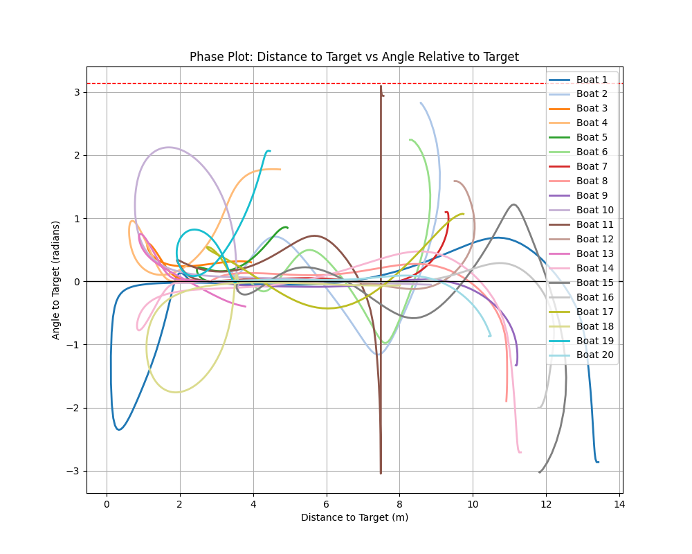
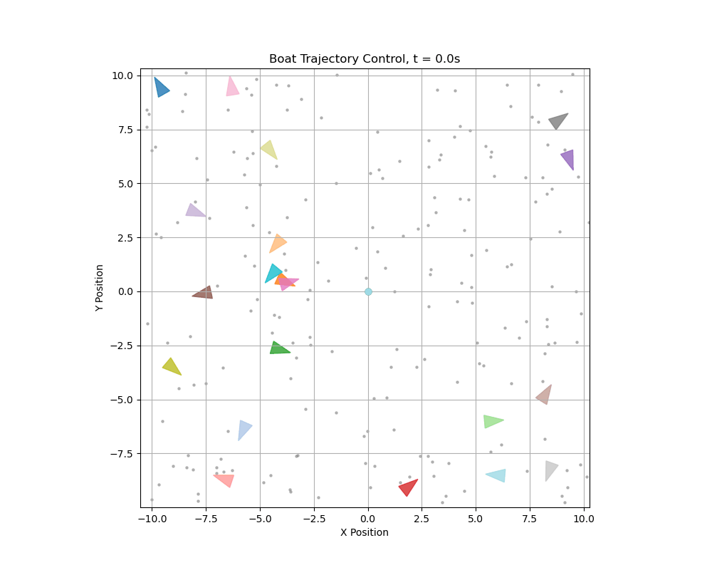
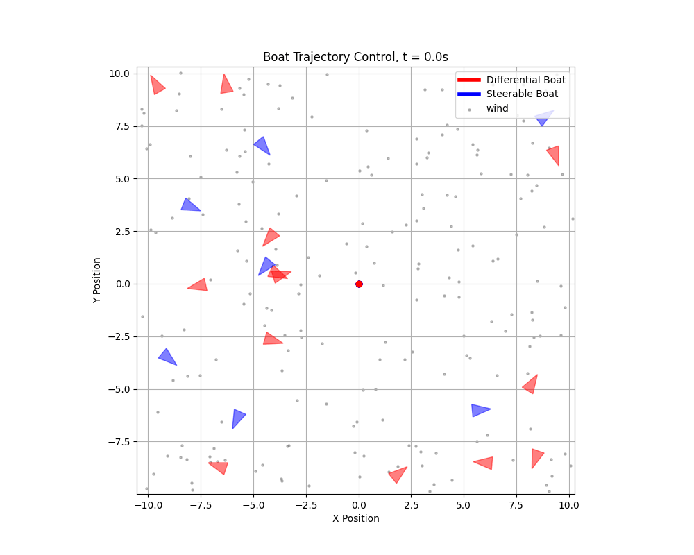
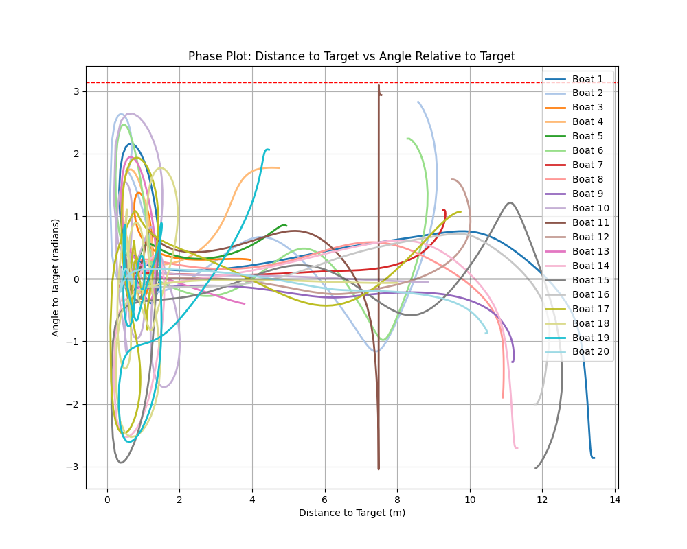
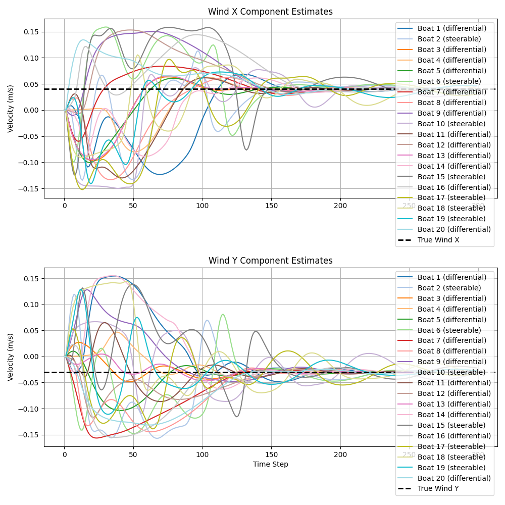
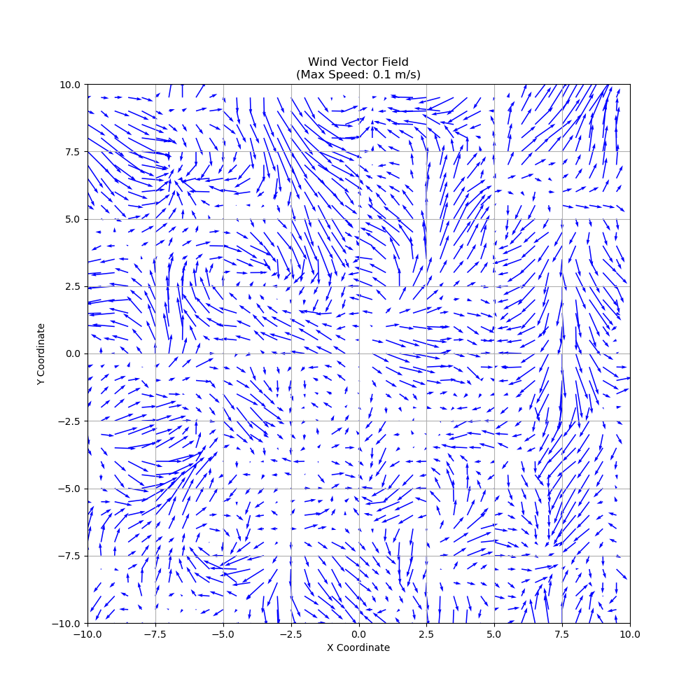
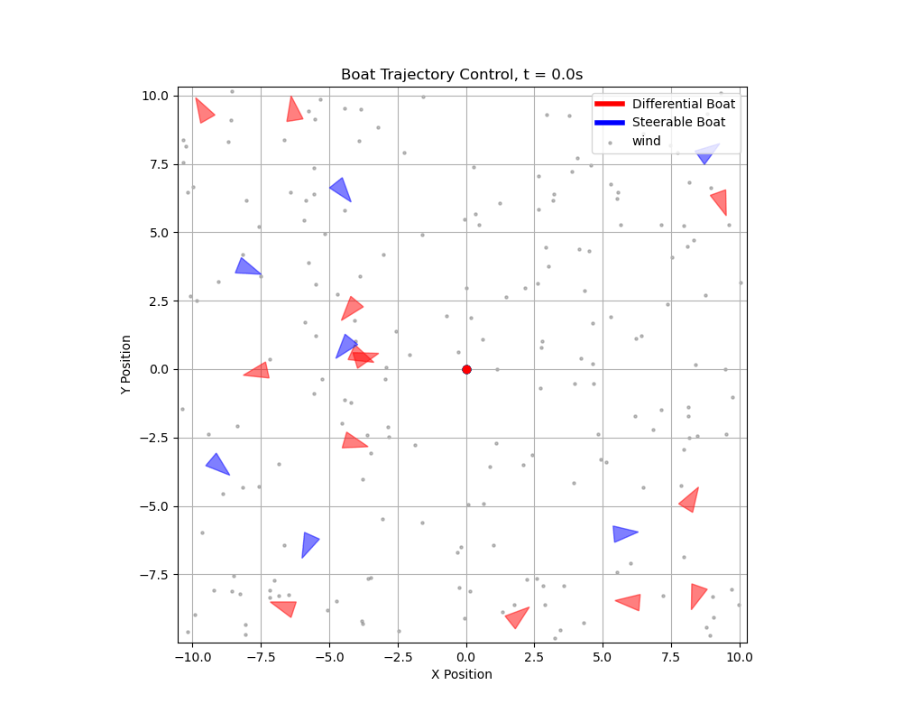

# Advanced Control: Motorized Vessel Control with Wind disturbance

## Overview

This project is focused on the **control** of a motorized boat using adaptive-based control under wind disturbance using adaptive backstepping controller.


## Task Definition

Given the initial state $\mathbf{x}_i$ and a desired position $\mathbf{x}_d$, the goal is to design a control law $\mathbf{u} = [u_1, u_2]^T$ such that the boat will reach the desired position with zero velocity, despite wind disturbances.
The boat can finish at any angle. The thruster force can only be applied in the forward direction.

---

**TODO:** add gif of the solution

---

## Updated Wind Fields

To test the control system under varying environmental conditions, we implemented **three distinct wind field models**:

1. **Cosine Wind Field**:
   A spatially varying wind defined by sinusoidal functions, simulating periodic gusts.

   $$
   V(x,y) = A \left(1 + B\cos\left(\frac{2\pi \text{ dist}}{\lambda}\right)\right)
   $$  

   where:
     - $A$, $B$ are `base_speed` and wave `amplitude`
     - $\text{dist}$ is a `distance` aling wind direction
     - $\lambda$ is a `wavelength`.  

2. **Perlin Noise Wind Field**:  
   A procedurally generated turbulent wind using Perlin noise, mimicking natural randomness. 

3. **Constant Directional Wind**:  
   A uniform wind $(V_{wx}, V_{wy})$ with fixed magnitude/direction.  

  
*Figure: Visualization of the three wind field types (cosine, Perlin noise, constant) used in simulations.*  


## Boats experience additional **unknown** drag effects from Water

Beyond wind disturbances, the boats are subject to hydrodynamic drag forces that dissipate kinetic energy. These effects are **modeled as unmeasured damping terms** in the dynamics:  

$$
\begin{aligned}
\dot{V}_f &= -D_f \cdot V_f \quad &\text{(Surge damping)}, \\
\dot{V}_s &= -D_s \cdot V_s \quad &\text{(Sway damping)}, \\
\dot{\omega} &= -D_ψ \cdot \omega \quad &\text{(Yaw damping)},
\end{aligned}
$$

where:

- $V_f, V_s$ are surge/sway velocities in the body frame,  
- $\omega$ is the yaw rate,  
- $D_f, D_s, D_ψ$ are unknown damping coefficients.  

Demonstration of the Drag Force:  
  


## Mathematical Model

### Boat Kinematics

Let the state vector of the boat be represented as:

$$
\mathbf{x} = \begin{bmatrix} x, & y, & \psi, & V_x, & V_y, & \omega \end{bmatrix}^T,
$$

where:

- $x, y$ are the position coordinates,
- $\psi$ is the yaw (heading),
- $V_x, V_y$ are the surge and sway velocities (linear velocities in the body-fixed frame),
- $\omega$ is the yaw rate.

#### Wind Model: Sail Interaction Model

The wind now exerts a **directional force** on the boat's sail, proportional to:
1. The **projected sail area** facing the wind (cosine of relative angle).
2. The **squared speed difference** between wind and boat (Bernoulli principle).


#### Wind Dynamic:
- **Relative wind velocity** (in boat's body frame):

  $$
  \begin{aligned}
  V_{wx}^b &= \cos(\psi) V_{wx} + \sin(\psi) V_{wy}, \\
  V_{wy}^b &= -\sin(\psi) V_{wx} + \cos(\psi) V_{wy}.
  \end{aligned}
  $$

- **Speed difference with wind**:

  $$
  \begin{aligned}
   \Delta V_{x}^b &= V_{wx}^b - V_x, \\
   \Delta V_{y}^b &= V_{wy}^b - V_y.
  \end{aligned}
  $$

#### Sail Force Calculation:
The total wind force in the boat's body frame is:

$$
\begin{aligned}
F_{sail,x} &= \frac{1}{2} \rho C_x A \cdot \Delta V_{x}^b, \\
F_{sail,y} &= \frac{1}{2} \rho C_y A \cdot \Delta V_{y}^b,
\end{aligned}
$$

where:
- $C_x$ = Drag coefficient for **surge** (longitudinal force),  
- $C_y$ = Drag coefficient for **sway** (lateral force),  
- $\rho$ = Air density,  
- $A$ = Effective sail area.  

Boats dragged by the wind:  


### Dynamics with Wind Disturbance  

The equations of the dynamics of the boat including wind effects have the following matrix form:

$$
\begin{bmatrix}
    \dot{x} \\
    \dot{y} \\
    \dot{\psi} \\
    \dot{V}_x \\
    \dot{V}_y \\
    \dot{\omega}
\end{bmatrix}
= \begin{bmatrix}
0 & 0 & 0 & \cos(\psi) & -\sin(\psi) & 0 \\
0 & 0 & 0 & \sin(\psi) & \cos(\psi) & 0 \\
0 & 0 & 0 & 0 & 0 & 1 \\
0 & 0 & 0 & -D_x & 0 & 0 \\
0 & 0 & 0 & 0 & -D_y & 0 \\
0 & 0 & 0 & 0 & 0 & -D_ψ
\end{bmatrix}
\begin{bmatrix}
    x \\
    y \\
    \psi \\
    V_x \\
    V_y \\
    \omega
\end{bmatrix} +
\begin{bmatrix}
0 & 0 & 0 \\
0 & 0 & 0 \\
0 & 0 & 0 \\
\frac{1}{m} & 0 & 0 \\
0 & \frac{1}{m} & 0 \\
0 & 0 & \frac{1}{I_z}
\end{bmatrix}
\left(
\begin{bmatrix}
F_x(u) \\
F_y(u) \\
M(u)
\end{bmatrix}
+ 
\underbrace{
\begin{bmatrix}
F_{sail,x} \\
F_{sail,y} \\
0
\end{bmatrix}
}_{\text{Sail contribution}}
\right)
$$

where:

- $m$ is the boat's mass,
- $I_z$ is the moment of inertia about the vertical axis,
- $D_x, D_y, D_\psi$ are the damping coefficients,
- $F_x, F_y$ are the forces due to the thrusters,
- $M$ is the moment generated by the thrusters, and
- $F_{sail,x}, F_{sail,y}$ are the wind forces by the sail.

#### Differential Drive Boat

$$
\begin{aligned}
F_x(u) &= u_1 + u_2\\
F_y(u) &= 0 \\
M(u) &= L(u_1 - u_2)
\end{aligned}
$$

where:

- $u_1$ and $u_2$ are the control inputs for the left and right motors, respectively.
- $L$ is the distance between the motor and the center of the boat.

#### Steerable Drive Boat

$$
\begin{aligned}
F_x(u) &= u_f \cos(u_\phi)\\
F_y(u) &= u_f \sin(u_\phi)\\
M(u) &= L \cdot u_f \sin(u_\phi)
\end{aligned}
$$

where:

- $u_f$ is the control for the motor.
- $u_\phi$ is the control for the steering angle.
- $L$ is the distance between the motor and the center of the boat.

## Adaptive Backstepping Controller Design for Boats

### Defining Error Coordinates

Let the error in global frame be:

$$
\begin{aligned}
e_x &= x - x_d \\
e_y &= y - y_d
\end{aligned}
$$

Transform into the body frame:

$$
\begin{bmatrix} e_f \\ e_s \end{bmatrix}
= R(\psi)^T \begin{bmatrix} e_x \\ e_y \end{bmatrix}, \quad R(\psi) = \begin{bmatrix} \cos\psi & -\sin\psi \\ \sin\psi & \cos\psi \end{bmatrix}
$$

where:

* $e_f$: forward position error
* $e_s$: lateral position error

We aim to design a control law to **drive $(e_f, e_s, V_x, V_y, \omega) \to 0$**.

### Step 1: Position Error Stabilization

Define Lyapunov candidate:

$$
L_1 = \frac{1}{2}(e_f^2 + e_s^2)
$$

Its derivative:

$$
\dot{L}_1 = e_f \dot{e}_f + e_s \dot{e}_s = -e_f V_x - e_s V_y
$$

Treat $(V_x, V_y)$ as virtual controls. Define desired velocity reference:

$$
\begin{aligned}
V_{x}^{\text{des}} &= -k_1 e_f \\
V_{y}^{\text{des}} &= -k_2 e_s
\end{aligned}
$$

Define velocity error:

$$
\begin{aligned}
\bar{e}_x &= V_x - V_{x}^{\text{des}} = V_x + k_1 e_f \\
\bar{e}_y &= V_y - V_{y}^{\text{des}} = V_y + k_2 e_s \\
\bar{e}_\omega &= \omega
\end{aligned}
$$

Then,

$$
\dot{L}_1 = -k_1 e_f^2 - k_2 e_s^2 + e_f \bar{e}_x + e_s \bar{e}_y
$$

### Step 2: Velocity Error Stabilization

Now use $(F_x, F_y)$ to regulate $(\bar{e}_x, \bar{e}_y)$.

Define:

$$
L_2 = L_1 + \frac{1}{2}(\bar{e}_x^2 + \bar{e}_y^2 + \bar{e}_\omega^2)
$$

Its derivative becomes:

$$
\begin{aligned}
\dot{L}_2 &= e_f \dot{e}_f + e_s \dot{e}_s + \bar{e}_x \dot{\bar{e}}_x + \bar{e}_y \dot{\bar{e}}_y + \bar{e}_\omega \dot{\bar{e}}_\omega \\
&= -k_1 e_f^2 - k_2 e_s^2 + e_f \bar{e}_x + e_s \bar{e}_y + \bar{e}_x \dot{V}_x + \bar{e}_y \dot{V}_y + \omega \dot{\omega}
\end{aligned}
$$


Now substitute dynamics:

$$
\begin{aligned}
\dot{V}_x &= \frac{1}{m}(F_x + F_{\text{sail},x}) - D_x V_x \\
\dot{V}_y &= \frac{1}{m}(F_y + F_{\text{sail},y}) - D_y V_y \\
\dot{\omega} &= \frac{1}{I_z}(M) - D_\psi \omega
\end{aligned}
$$

Substitute into $\dot{L}_2$:

$$
\begin{aligned}
\dot{L}_2 &= -k_1 e_f^2 - k_2 e_s^2 + e_f \bar{e}_x + e_s \bar{e}_y \\
&+ \bar{e}_x \left( \frac{1}{m}(F_x + F_{\text{sail},x}) - D_x V_x \right) \\
&+ \bar{e}_y \left( \frac{1}{m}(F_y + F_{\text{sail},y}) - D_y V_y \right) \\
&+ \omega \left( \frac{1}{I_z} M - D_\psi \omega \right)
\end{aligned}
$$

Now choose control law:

$$
\begin{aligned}
F_x &= -m k_3 \bar{e}_x + m D_x V_x - F_{\text{sail},x} \\
F_y &= -m k_4 \bar{e}_y + m D_y V_y - F_{\text{sail},y} \\
M &= -I_z k_5 \omega + I_z D_\psi \omega
\end{aligned}
$$

So:


$$
\dot{L}_2 = -k_1 e_f^2 - k_2 e_s^2 - k_3 \bar{e}_x^2 - k_4 \bar{e}_y^2 - k_5 \omega^2
$$


$\Rightarrow$ Asymptotically stable.

### Step 3: Adaptive Control for Unknown Forces

As the $F_{\text{sail}}$ and the damping coefficients $D_x, D_y, D_\psi$ are unknown, we model their combined effects as lumped disturbances:

$$
\begin{aligned}
\dot{V}_x &= \frac{1}{m} F_x + \Delta_x \\
\dot{V}_y &= \frac{1}{m} F_y + \Delta_y \\
\dot{\omega} &= \frac{1}{I_z} M + \Delta_\psi
\end{aligned}
$$

where:

- $\Delta_x = -D_x V_x + \frac{1}{m} F_{\text{sail},x}$
- $\Delta_y = -D_y V_y + \frac{1}{m} F_{\text{sail},y}$
- $\Delta_\psi = -D_\psi \omega$

We treat these disturbances as unknown but **linearly parameterized**:

$$
\Delta_x = \hat{\theta}_x^T \phi_x, \quad
\Delta_y = \hat{\theta}_y^T \phi_y, \quad
\Delta_\psi = \hat{\theta}_\psi^T \phi_\psi
$$

where:

- $\hat{\theta}_*$ are adaptive estimates of unknown parameters,
- $\phi_*$ are known features (e.g. $\phi_x = [V_x]$, $\phi_y = [V_y]$, $\phi_\psi = [\omega]$).

#### Updated Control Laws with Online Adaptation

We compensate the unknown terms using their estimates:

$$
\begin{aligned}
F_x &= -m k_3 \bar{e}_x + m \hat{\theta}_x^T \phi_x \\
F_y &= -m k_4 \bar{e}_y + m \hat{\theta}_y^T \phi_y \\
M   &= -I_z k_5 \omega + I_z \hat{\theta}_\psi^T \phi_\psi
\end{aligned}
$$

#### Parameter Update Laws

We update the unknown parameters online using a simple adaptive rule:

$$
\begin{aligned}
\dot{\hat{\theta}}_x &= \Gamma_x \phi_x \bar{e}_x \\
\dot{\hat{\theta}}_y &= \Gamma_y \phi_y \bar{e}_y \\
\dot{\hat{\theta}}_\psi &= \Gamma_\psi \phi_\psi \omega
\end{aligned}
$$

where $\Gamma_*$ are positive adaptation gains.

#### Result

With this adaptive controller, the system remains stable, and the controller gradually learns the unknown wind and damping effects, ensuring convergence:

$$
\dot{L}_2 = -k_1 e_f^2 - k_2 e_s^2 - k_3 \bar{e}_x^2 - k_4 \bar{e}_y^2 - k_5 \omega^2 \le 0
$$


### Differential Drive Controller

From the control law, we compute desired total forward force $F_x$ and yaw moment $M$. For differential thrust, assume:

$$
\begin{aligned}
u_1 + u_2 &= F_x \\
L(u_1 - u_2) &= M
\end{aligned}
$$

Solving:

$$
\begin{aligned}
u_1 &= \frac{1}{2}\left(F_x + \frac{M}{L}\right) \\
u_2 &= \frac{1}{2}\left(F_x - \frac{M}{L}\right)
\end{aligned}
$$


### Steerable Thruster Controller

Given:

$$
\begin{aligned}
F_x &= u_f \cos u_\phi \\
F_y &= u_f \sin u_\phi \\
M &= L \cdot u_f \sin(u_\phi) = L \cdot F_y
\end{aligned}
$$

We recover thrust magnitude and steering angle from control forces:

$$
\begin{aligned}
u_\phi &= \text{atan2}(F_y, F_x) \\
u_f &= \sqrt{F_x^2 + F_y^2}
\end{aligned}
$$

## 7. Summary of the Adaptive Control Law

| Component                | Expression                                                                 |
|--------------------------|----------------------------------------------------------------------------|
| Desired velocities       | $V_x = -k_1 e_f$, $V_y = -k_2 e_s$                                         |
| Velocity errors          | $\bar{e}_x = V_x + k_1 e_f$, $\bar{e}_y = V_y + k_2 e_s$, $\bar{e}_\omega = \omega$ |
| Force commands           | $F_x = -m k_3 \bar{e}_x + m \hat{\theta}_x^T \phi_x$                      |
|                          | $F_y = -m k_4 \bar{e}_y + m \hat{\theta}_y^T \phi_y$                      |
| Moment command           | $M = -I_z k_5 \omega + I_z \hat{\theta}_\psi^T \phi_\psi$                 |
| Thruster Mapping (diff)  | $u_1 = \frac{1}{2}(F_x + M/L)$, $u_2 = \frac{1}{2}(F_x - M/L)$             |
| Thruster Mapping (steer) | $u_f = \sqrt{F_x^2 + F_y^2}$, $u_\phi = \text{atan2}(F_y, F_x)$           |


### Old energy-based control with wind:

As we can see the energy-based control that assumes zero wind cannot provide good control to reach zero position.


### Phase plot



### Adaptive Control

To handle unknown wind disturbances $(V_{wx}, V_{wy})$, we augment the energy-based controller with an adaptation law that adapts and compensates for the wind effects during the work.

#### **1. State Augmentation**

Define the **augmented state vector** to include wind disturbance adaptation:

$$
\mathbf{x_a} = \begin{bmatrix} x, y, \psi, V_x, V_y, \omega, \hat{V_{wx}}, \hat{V_{wy}} \end{bmatrix}^T,
$$

where $\hat{V_{wx}}, \hat{V_{wy}}$ are adaptation parameters of the wind velocities in global frame.

The **main challenges** was to handle the different coordinates systems, as wind given in global coordinates, but boat velocities in local boat frame.

#### **2. Modified Lyapunov Function**  

Introduce a Lyapunov function including adaptation errors:

$$
E_a = E + \frac{1}{2 \gamma_w} \tilde{V_{wx}}^2 + \frac{1}{2 \gamma_w} \tilde{V_{wy}}^2,
$$

where:

- $\gamma_x, \gamma_y > 0$ are adaptation gains.
- $\tilde{V_{wx}} = V_{wx} - \hat{V_{wx}}$ and $\tilde{V_{wy}} = V_{wy} - \hat{V_{wy}}$ are adaptation errors.

#### **3. Adaptation Laws**

Derive adaptation laws by ensuring $\dot{E}_a \leq 0$:

$$
\begin{aligned}
\dot{\hat{V_{wx}}} &= - \gamma_w \left( \hat{V_{wx}} + V_{xGlobal} \right), \\
\dot{\hat{V_{wy}}} &= - \gamma_w \left( \hat{V_{wy}} + V_{yGlobal} \right).
\end{aligned}
$$

where:
- $V_{xGlobal}$ and $V_{yGlobal}$ are boat speed in global coordinates:

$$
\begin{aligned}
V_{xGlobal} &= \cos(\psi) V_x - \sin(\psi) V_y, \\
V_{yGlobal} &= \sin(\psi) V_x + \cos(\psi) V_y.
\end{aligned}
$$

#### **4. Adaptive Control Laws**

**Differential Drive:**

$$
\begin{aligned}
u_1 &= k_0 x_e - k_1 \left( x_e (V_x - \hat{V_{wxLocal}}) + y_e (V_y - \hat{V_{wyLocal}}) - \omega \right) - k_2 \psi_e - k_w \hat{V_{wxLocal}}, \\
u_2 &= k_0 x_e - k_1 \left( x_e (V_x - \hat{V_{wxLocal}}) + y_e (V_y - \hat{V_{wyLocal}}) + \omega \right) + k_2 \psi_e - k_w \hat{V_{wxLocal}}.
\end{aligned}
$$

**Steerable Drive:**

$$
\begin{aligned}
u_f &= k_0 (x_e^2 + y_e^2) - k_1 \left( x_e (V_x - \hat{V_{wxLocal}}) + y_e (V_y - \hat{V_{wyLocal}}) \right) - k_w \hat{V_{wxLocal}}, \\
u_\phi &= k_2 \psi_e.
\end{aligned}
$$

**where:**
- $\hat{V_{wxLocal}}$ and $\hat{V_{wyLocal}}$ are adaptation parameters for wind velocities in the boat frame:

$$
\begin{aligned}
\hat{V_{wxLocal}} &=  \cos(\psi) \dot{\hat{V_{wx}}} + \sin(\psi) \dot{\hat{V_{wy}}}, \\
\hat{V_{wyLocal}} &= -\sin(\psi) \dot{\hat{V_{wx}}} + \cos(\psi) \dot{\hat{V_{wy}}}.
\end{aligned}
$$

## Repository Structure

### `control.py`

This file contains the `Controller` classes for **Differential** and **Steering** boats, which computes the control inputs based on the boat state, desired state.

### `boat.py`

This file contains two boat classes `DifferentialThrustBoat` and `SteerableThrustBoat` that models boat dynamics, given the current control inputs.

### `visualization.py`

This module provides functions to visualize the boat trajectory and desired position.
The visualization has three modes: 'gif', 'realtime', 'final'. The 'gif' mode generates a GIF of the boat motion, 'realtime' shows the simulation in real-time, and 'final' displays the final trajectory after the simulation.

### `main.py`

The `main.py` file is the entry point for the simulation. It initializes the boat, sets up the controller, and runs the simulation loop. At each time step, the control inputs are computed, and the boat state is updated. The trajectory is then visualized.

## How to Run

To run the simulation, simply execute the `main.py` file:

```bash
python main.py
```

## Simulation Setup

### Initial Conditions

- **Initial state ($\mathbf{x}_i$)**:

$$
\mathbf{x_a} = \begin{bmatrix} x, y, \psi, V_x, V_y, \omega, \hat{V_{wx}}, \hat{V_{wy}} \end{bmatrix}^T,
$$

- We have randomly generated 20 differential/steering boats. Each board has zero initial speeds. The initial position and yaw (heading) are arbitrary.

- **Wind disturbance adaptation**: The initial adaptation parameters for wind velocities $\hat{V_{wx}}$ and $\hat{V_{wy}}$ are initialized to zero.

- **The desired reference trajectory** for each boat is defined by a target position $x_d, y_d$ for convinients every target position were set to origin of the coordinate system.

- **Simulation duration**: The simulation runs for a total time of $T = 300$ seconds, with a time step $\Delta t = 1$ second.

## Results

## Adaptive control

### First iteration of adding wind adaptation




### Successfull implementation

We can see that adaptive control can successfully adapt to the wind:



### Phase plot



### Wind Adaptation



### Control by time

#### Control for differential boats


#### Control for steerable boats


## Control of boats inside Wind vector field

**Wind Field:**  


