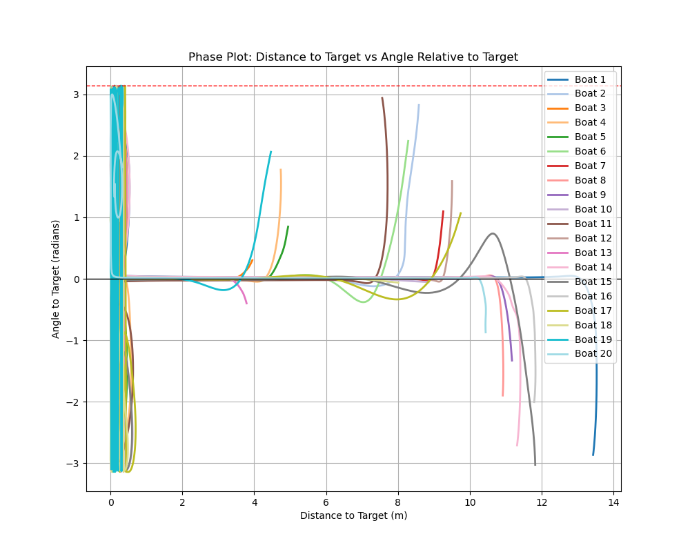

# Advanced Control: Motorized Vessel Control with Wind disturbance

## Overview

This project is focused on the **control** of a motorized boat using adaptive-based control under wind disturbance using adaptive backstepping controller.


## Task Definition

Given the initial state $\mathbf{x}_i$ and a desired position $\mathbf{x}_d$, the goal is to design a control law $\mathbf{u} = [u_1, u_2]^T$ such that the boat will reach the desired position with zero velocity, despite wind disturbances.
The boat can finish at any angle. The thruster force can only be applied in the forward direction.


## Updated Wind Fields

To test the control system under varying environmental conditions, we implemented **three distinct wind field models**:

1. **Cosine Wind Field**:
  A spatially varying wind defined by sinusoidal functions, simulating periodic gusts.

$$
V(x,y) = A \left(1 + B \cos \left( \frac{2\pi d}{\lambda} \right) \right)
$$  

where:
  - $A$, $B$ are `base_speed` and wave `amplitude`
  - $d$ is a `distance` aling wind direction
  - $\lambda$ is a `wavelength`.  

2. **Perlin Noise Wind Field**:  
   A procedurally generated turbulent wind using Perlin noise, mimicking natural randomness. 

3. **Constant Directional Wind**:  
   A uniform wind $(V_{wx}, V_{wy})$ with fixed magnitude/direction.  

  
*Figure: Visualization of the three wind field types (cosine, Perlin noise, constant) used in simulations.*  


## Boats experience additional **unknown** drag effects from Water

Beyond wind disturbances, the boats are subject to hydrodynamic drag forces that dissipate kinetic energy. These effects are **modeled as unmeasured damping terms** in the dynamics:  

$$
\begin{aligned}
\dot{V}_f &= -D_f \cdot V_f \quad &\text{(Surge damping)}, \\
\dot{V}_s &= -D_s \cdot V_s \quad &\text{(Sway damping)}, \\
\dot{\omega} &= -D_ψ \cdot \omega \quad &\text{(Yaw damping)},
\end{aligned}
$$

where:

- $V_f, V_s$ are surge/sway velocities in the body frame,  
- $\omega$ is the yaw rate,  
- $D_f, D_s, D_ψ$ are unknown damping coefficients.  

Demonstration of the Drag Force:  
  


## Mathematical Model

### Boat Kinematics

Let the state vector of the boat be represented as:

$$
\mathbf{x} = \begin{bmatrix} x, & y, & \psi, & V_x, & V_y, & \omega \end{bmatrix}^T,
$$

where:

- $x, y$ are the position coordinates,
- $\psi$ is the yaw (heading),
- $V_x, V_y$ are the surge and sway velocities (linear velocities in the body-fixed frame),
- $\omega$ is the yaw rate.

#### Wind Model: Sail Interaction Model

The wind now exerts a **directional force** on the boat's sail, proportional to:
1. The **projected sail area** facing the wind (cosine of relative angle).
2. The **speed difference** between wind and boat (Bernoulli principle).


#### Wind Dynamic:
- **Relative wind velocity** (in boat's body frame):

$$
\begin{aligned}
V_{wx}^b &= \cos(\psi) V_{wx} + \sin(\psi) V_{wy}, \\
V_{wy}^b &= -\sin(\psi) V_{wx} + \cos(\psi) V_{wy}.
\end{aligned}
$$

- **Speed difference with wind**:

$$
\begin{aligned}
  \Delta V_{x}^b &= V_{wx}^b - V_x, \\
  \Delta V_{y}^b &= V_{wy}^b - V_y.
\end{aligned}
$$

#### Sail Force Calculation:
The total wind force in the boat's body frame is:

$$
\begin{aligned}
F_{sail,x} &= \frac{1}{2} \rho C_x A \cdot \Delta V_{x}^b, \\
F_{sail,y} &= \frac{1}{2} \rho C_y A \cdot \Delta V_{y}^b,
\end{aligned}
$$

where:
- $C_x$ = Drag coefficient for **surge** (longitudinal force),  
- $C_y$ = Drag coefficient for **sway** (lateral force),  
- $\rho$ = Air density,  
- $A$ = Effective sail area.  

Boats dragged by the wind:  


### Dynamics with Wind Disturbance  

The equations of the dynamics of the boat including wind effects have the following matrix form:

$$
\begin{bmatrix}
    \dot{x} \\
    \dot{y} \\
    \dot{\psi} \\
    \dot{V}_x \\
    \dot{V}_y \\
    \dot{\omega}
\end{bmatrix}
= \begin{bmatrix}
0 & 0 & 0 & \cos(\psi) & -\sin(\psi) & 0 \\
0 & 0 & 0 & \sin(\psi) & \cos(\psi) & 0 \\
0 & 0 & 0 & 0 & 0 & 1 \\
0 & 0 & 0 & -D_x & 0 & 0 \\
0 & 0 & 0 & 0 & -D_y & 0 \\
0 & 0 & 0 & 0 & 0 & -D_ψ
\end{bmatrix}
\begin{bmatrix}
    x \\
    y \\
    \psi \\
    V_x \\
    V_y \\
    \omega
\end{bmatrix} +
\begin{bmatrix}
0 & 0 & 0 \\
0 & 0 & 0 \\
0 & 0 & 0 \\
\frac{1}{m} & 0 & 0 \\
0 & \frac{1}{m} & 0 \\
0 & 0 & \frac{1}{I_z}
\end{bmatrix}
\left(
\begin{bmatrix}
F_x(u) \\
F_y(u) \\
M(u)
\end{bmatrix} + 
\begin{bmatrix}
F_x^{sail} \\
F_y^{sail} \\
0 
\end{bmatrix}
\right)
$$

where:

- $m$ is the boat's mass,
- $I_z$ is the moment of inertia about the vertical axis,
- $D_x, D_y, D_\psi$ are the damping coefficients,
- $F_x, F_y$ are the forces due to the thrusters,
- $M$ is the moment generated by the thrusters, and
- $F_{sail,x}, F_{sail,y}$ are the wind forces by the sail.

#### Differential Drive Boat

$$
\begin{aligned}
F_x(u) &= u_1 + u_2\\
F_y(u) &= 0 \\
M(u) &= L(u_1 - u_2)
\end{aligned}
$$

where:

- $u_1$ and $u_2$ are the control inputs for the left and right motors, respectively.
- $L$ is the distance between the motor and the center of the boat.

#### Steerable Drive Boat

$$
\begin{aligned}
F_x(u) &= u_f \cos(u_\phi)\\
F_y(u) &= u_f \sin(u_\phi)\\
M(u) &= L \cdot u_f \sin(u_\phi)
\end{aligned}
$$

where:

- $u_f$ is the control for the motor.
- $u_\phi$ is the control for the steering angle.
- $L$ is the distance between the motor and the center of the boat.

## Adaptive Backstepping Controller Design for Underactuated Boats

### Defining Error Coordinates

Let the error in global frame be:

$$
\begin{aligned}
e_x &= x - x_d \\
e_y &= y - y_d
\end{aligned}
$$

Let the desired heading be:

$$
\psi_d = \text{atan2}(y_d - y, x_d - x)
$$

Define body-frame forward error and heading error:

$$
\begin{aligned}
e_f &= \cos(\psi - \psi_d)(x - x_d) + \sin(\psi - \psi_d)(y - y_d) \\
e_\psi &= \psi - \psi_d
\end{aligned}
$$

We aim to drive $(e_f, e_\psi, V_x, \omega) \to 0$.

---

### Step 1: Position and Heading Error Stabilization

Define Lyapunov function:

$$
L_1 = \frac{1}{2}(e_f^2 + e_\psi^2)
$$

Time derivative:

$$
\dot{L_1} = e_f \dot{e_f} + e_\psi \dot{e_\psi}
$$

Assume:
- $\dot{e}_f \approx -V_x$ (forward progress reduces error)
- $\dot{e}_\psi = \omega$

Then:

$$
\dot{L_1} = -e_f V_x + e_\psi \omega
$$

Define desired virtual controls:

$$
\begin{aligned}
V_x^{\text{des}} &= k_1 e_f \\
\omega^{\text{des}} &= -k_2 e_\psi
\end{aligned}
$$

Define tracking errors:

$$
\begin{aligned}
\bar{e_x} &= V_x - V_x^{des} = V_x - k_1 e_f \\
\bar{e_\omega} &= \omega - \omega^{\text{des}} = \omega + k_2 e_\psi
\end{aligned}
$$

### Step 2: Velocity Error Stabilization

Augment the Lyapunov function:

$$
L_2 = L_1 + \frac{1}{2}(\bar{e_x^2} + \bar{e_\omega^2})
$$

Compute its derivative:

$$
\begin{aligned}
\dot{L_2} &= -e_f \bar{e_x} + e_\psi (-\bar{e_\omega} + k_2 e_\psi) + \bar{e_x} \dot{V_x} + \bar{e_\omega} \dot{\omega} \\
&= -k_1 e_f^2 - k_2 e_\psi^2 + \bar{e_x} \dot{V_x} + \bar{e_\omega} \dot{\omega}
\end{aligned}
$$

Use the system dynamics:

$$
\begin{aligned}
\dot{V_x} &= \frac{1}{m} F_x + \Delta_x \\
\dot{\omega} &= \frac{1}{I_z} M + \Delta_\psi
\end{aligned}
$$

### Step 3: Adaptive Control for Unknown Forces

We model $\Delta_x, \Delta_\psi$ as linearly parameterized unknowns:

$$
\Delta_x = \hat{\theta_x^T} \phi_x, \quad \Delta_\psi = \hat{\theta_\psi^T} \phi_\psi
$$

Control laws:

$$
\begin{aligned}
F_x &= -m k_3 \bar{e_x} + m \hat{\theta_x^T} \phi_x \\
M   &= -I_z k_4 \bar{e_\omega} + I_z \hat{\theta_\psi^T} \phi_\psi
\end{aligned}
$$

Adaptation laws:

$$
\begin{aligned}
\dot{\hat{\theta_x}} &= \Gamma_x \phi_x \bar{e_x} \\
\dot{\hat{\theta_\psi}} &= \Gamma_\psi \phi_\psi \bar{e_\omega}
\end{aligned}
$$

Then:

$$
\dot{L_2} = -k_1 e_f^2 - k_2 e_\psi^2 - k_3 \bar{e_x^2} - k_4 \bar{e_\omega^2} \le 0
$$

### Differential Drive Controller

From the control law, we compute:

$$
\begin{aligned}
u_1 + u_2 &= F_x \\
L(u_1 - u_2) &= M
\end{aligned}
$$

Solve:

$$
\begin{aligned}
u_1 &= \frac{1}{2}\left(F_x + \frac{M}{L}\right) \\
u_2 &= \frac{1}{2}\left(F_x - \frac{M}{L}\right)
\end{aligned}
$$


### Steerable Thruster Controller

For steerable drive, we apply thrust $u_f$ at an angle $u_\phi$. The control forces are:

$$
\begin{aligned}
F_x &= u_f \cos u_\phi \\
M   &= L \cdot u_f \sin u_\phi
\end{aligned}
$$

Solve:

$$
\begin{aligned}
u_\phi &= \text{atan2}(M / L, F_x) \\
u_f &= \sqrt{F_x^2 + \left(\frac{M}{L}\right)^2}
\end{aligned}
$$

This gives a unique solution as long as $L \neq 0$ and thrust is always forward ($u_f \geq 0$).


## Summary of the Adaptive Control Law (Underactuated Case)

| Component                | Expression                                                                 |
|--------------------------|----------------------------------------------------------------------------|
| Desired velocities       | $V_x = k_1 e_f$, $\omega = -k_2 e_\psi$                                    |
| Velocity errors          | $\bar{e_x} = V_x - k_1 e_f$, $\bar{e_\omega} = \omega + k_2 e_\psi$        |
| Force command            | $F_x = -m k_3 \bar{e}_x + m \hat{\theta}_x^T \phi_x$                       |
| Moment command           | $M = -I_z k_4 \bar{e_\omega} + I_z \hat{\theta_\psi^T} \phi_\psi$          |
| Adaptive update laws     | $\dot{\hat{\theta_x}} = \Gamma_x \phi_x \bar{e_x}$, $\dot{\hat{\theta_\psi}} = \Gamma_\psi \phi_\psi \bar{e_\omega}$ |
| Thruster Mapping (diff)  | $u_1 = \frac{1}{2}(F_x + M/L)$, $u_2 = \frac{1}{2}(F_x - M/L)$             |
| Thruster Mapping (steer) | $u_\phi = \text{atan2}(M / L, F_x)$, $u_f = \sqrt{F_x^2 + \left(\frac{M}{L}\right)^2}$ |

## Control Gain Selection via Linearized Stability Analysis

To choose optimal gains for the adaptive backstepping controller, we analyze the closed-loop dynamics around the equilibrium point using linearization. The goal is to derive conditions under which the system is asymptotically stable, with eigenvalues that are:

* Real
* Negative
* Equal (for fastest non-oscillatory convergence)

### Step 1: Define Linearized Error Dynamics

Let the system state error vector be:

$$
\mathbf{e} = \begin{bmatrix} e_f \\ \bar{e_x} \\ e_\psi \\ \bar{e_\omega} \end{bmatrix}
$$

From the adaptive backstepping design, the closed-loop linearized dynamics (assuming constant estimates) are:

$$
\begin{aligned}
\dot{e_f} &= -\bar{e_x} \\
\dot{\bar{e_x}} &= -k_1 e_f - k_3 \bar{e_x} \\
\dot{e_\psi} &= -\bar{e_\omega} \\
\dot{\bar{e_\omega}} &= -k_2 e_\psi - k_4 \bar{e_\omega}
\end{aligned}
$$

We can express this in state-space form:

$$
\dot{\mathbf{e}} = A \mathbf{e}, \quad \text{where}
$$

$$
A = \begin{bmatrix}
0 & -1 & 0 & 0 \\
-k_1 & -k_3 & 0 & 0 \\
0 & 0 & 0 & -1 \\
0 & 0 & -k_2 & -k_4
\end{bmatrix}
$$

This matrix is block diagonal, so the eigenvalues split into two subsystems:

* Translational subsystem ($e_f, \bar{e}_x$)
* Rotational subsystem ($e_\psi, \bar{e}_\omega$)

### Step 2: Compute Eigenvalues Symbolically

Each 2x2 block has the form:

$$
\begin{bmatrix} 0 & -1 \\ -k_i & -k_j \end{bmatrix}
$$

The characteristic polynomial is:

$$
\lambda^2 + k_j \lambda + k_i = 0
$$

So the eigenvalues are:

$$
\lambda = \frac{-k_j \pm \sqrt{k_j^2 - 4k_i}}{2}
$$

### Step 3: Make Eigenvalues Real, Equal, Negative

To ensure real and equal eigenvalues:

* Discriminant = 0: $k_j^2 = 4k_i$
* Eigenvalue: $\lambda = -\frac{k_j}{2} < 0$

So choose:

$$
\boxed{k_i = \frac{k_j^2}{4}} \quad \text{with } k_j > 0
$$

### Step 4: Apply to Our System

Let:

* Translational: $k_1 = \frac{k_3^2}{4}$
* Rotational: $k_2 = \frac{k_4^2}{4}$

This ensures both subsystems have identical, negative, real eigenvalues:

$$
\lambda = -\frac{k_3}{2}, \quad \lambda = -\frac{k_4}{2}
$$

## Repository Structure

### `control.py`

This file contains the `Controller` classes for **Differential** and **Steering** boats, which computes the control inputs based on the boat state, desired state.

### `boat.py`

This file contains two boat classes `DifferentialThrustBoat` and `SteerableThrustBoat` that models boat dynamics, given the current control inputs.

### `visualization.py`

This module provides functions to visualize the boat trajectory and desired position.
The visualization has three modes: 'gif', 'realtime', 'final'. The 'gif' mode generates a GIF of the boat motion, 'realtime' shows the simulation in real-time, and 'final' displays the final trajectory after the simulation.

### `main.py`

The `main.py` file is the entry point for the simulation. It initializes the boat, sets up the controller, and runs the simulation loop. At each time step, the control inputs are computed, and the boat state is updated. The trajectory is then visualized.

## How to Run

To run the simulation, simply execute the `main.py` file:

```bash
python main.py
```

## Simulation Setup

### Initial Conditions

- **Initial state ($\mathbf{x}_i$)**:

$$
\mathbf{x_a} = \begin{bmatrix} x, y, \psi, V_x, V_y, \omega, \hat{V_{wx}}, \hat{V_{wy}} \end{bmatrix}^T,
$$

- We have randomly generated 20 differential/steering boats. Each board has zero initial speeds. The initial position and yaw (heading) are arbitrary.

- **Wind disturbance adaptation**: The initial adaptation parameters for wind velocities $\hat{V_{wx}}$ and $\hat{V_{wy}}$ are initialized to zero.

- **The desired reference trajectory** for each boat is defined by a target position $x_d, y_d$ for convinients every target position were set to origin of the coordinate system.

- **Simulation duration**: The simulation runs for a total time of $T = 80$ seconds, with a time step $\Delta t = 0.2$ second.

## Results

## Adaptive Backstepping Controller results


### Phase plot

constant phase plot:  


cosine phase plot:  


perlin phase plot:  


### Wind Adaptation


### Control by time

#### Control for differential boats


#### Control for steerable boats


