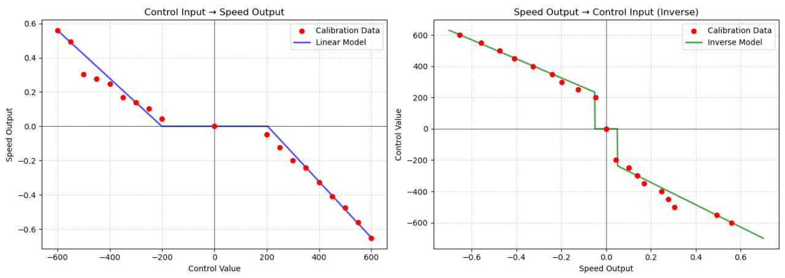

# Advanced Control: Model Predictive Control for Real Cart-Pole

## Overview

This project is focused on the **control** of a real cart-pole stand with model predictive control.


## Mathematical Model


We represent cart-pole as:

$$
\mathbf{x} = \begin{bmatrix} x, & \dot x, & \theta, & \dot \theta  \end{bmatrix}^T,
$$

where:

- $x, \dot x$ are the position and velocity of the cart,
- $\theta, \dot \theta$ are the angle and angular velocity of the pole,

### Dynamics of the cart-pole

To account for real friction, we added viscouse and coulomb friction to the mathematical model.


* **Viscous friction** is proportional to velocity:

  $$
  F_{\text{viscous}} = -b \cdot \dot{x}
  $$

* **Coulomb friction** is a constant opposing motion direction:

  $$
  F_{\text{Coulomb}} = -f \cdot \mathrm{sign}(\dot{x})
  $$

### Final equations of motion:

Let:
- $M$: cart mass  
- $m$: pole mass  
- $L$: pole length  
- $b_c, f_c$: viscous and Coulomb friction coefficients for the cart  
- $b_p, f_p$: viscous and Coulomb friction for the pole  
- $u_{\text{speed}}$: virtual velocity control input  
- $K_p$: virtual force gain

Then:

$$
\begin{aligned}
F_{\text{cart}} &= K_p \cdot (u_{\text{speed}} - \dot{x}) - b_c \cdot \dot{x} - f_c \cdot \text{sign}(\dot{x}) \\
T_{\text{pole}} &= -b_p \cdot \dot{\theta} - f_p \cdot \text{sign}(\dot{\theta})
\end{aligned}
$$

Let:
- $D = M + m$
- $ml\cos(\theta) = m \cdot L \cdot \cos(\theta)$
- $\alpha = mL^2 - \frac{(ml\cos(\theta))^2}{D}$

The angular acceleration $\ddot{\theta}$ is:

$$
\ddot{\theta} = \frac{ -mgL\sin(\theta) - \frac{ml\cos(\theta)}{D}(-MF_{\text{cart}} + mL\dot{\theta}^2\sin(\theta) + b_c \dot{x} + f_c \text{sign}(\dot{x})) + T_{\text{pole}} }{ \alpha }
$$

The linear acceleration $\ddot{x}$ is:

$$
\ddot{x} = \frac{ F_{\text{cart}} + mL(\dot{\theta}^2 \sin(\theta) - \ddot{\theta} \cos(\theta)) }{ D }
$$

## Methematical Model estimation


### To estimatete real-world parameters we record a lot of samples of cart-pole free movement:


### As we can see we have a very fast oscilation decrease, which show that we have a lot of Coulong frictions.


Estimating of the friction:


### But this didn't work well, so I decided to use scipy optimize to find system parameters


That even works with 


**The final estimated system parameters:**

| Parameter | Value | Description |
|-----------|-------|-------------|
| `M`       | 4.5 kg | Cart mass |
| `m`       | 0.300 kg | Pole mass |
| `l`       | 0.227 m | Pole length |
| `b_c`     | 0.8 | Viscous friction (cart) |
| `f_c`     | 0.9 | Coulomb friction (cart) |
| `b_p`     | 0.0028 | Viscous friction (pole) |
| `f_p`     | 0.0095 | Coulomb friction (pole) |
| `K_p`     | 100 | Virtual Force |


## Estimation of the control curve

As we send comands for the motor as a some random value, we need to get it from the desired velocity.

For this purpose I recorded several samples of robot motion with different control, and defined this calibration curve:




As we could see we have a big dead-zone at the middle, as we have a lot of friction in our system.


## Controler Definition

I decided to split control task into two subtusks:
- Swing-up controller
- Stabilizing controller

### Swing-up Energy-Based NMPC controller


The **Swing-Up Controller** is designed to bring the cart-pole from a stable downward position to the upright one (θ ≈ π). 

It uses a **nonlinear model predictive control (NMPC)** approach with an **energy-based cost function**.

#### Key Features:

* Optimizes control sequence over a several step ahead.
* Incorporates the physical energy of the system:
  * **Kinetic energy** of the pole
  * **Potential energy** relative to the upright position
  * **Position penalty** to prefer swing-ups near the cart center
  * **Effort penalty** to regularize control magnitude

#### Cost Function:

The total cost is minimized using a weighted combination:

$$
\text{Cost} = -c_0 \cdot |x|^2 + c_1 \cdot E_{\text{kinetic}} + c_2 \cdot E_{\text{potential}} - c_3 \cdot u^2
$$

Where:

* $x$: cart position
* $u$: control input (velocity command)
* $E\_{\text{kinetic}} = \frac{1}{2} m L^2 \dot{\theta}^2$
* $E\_{\text{potential}} = m g L (1 - \cos(\theta))$


#### Result:


### Stabilizing NMPC controller

Once the pole is near the upright position (θ ≈ π), we switch to a **Stabilizing Nonlinear MPC controller** to precisely balance it and hold the cart close to the center (x ≈ 0).

#### Control Objectives:

* **Balance the pole** vertically
* **Stabilize the cart** near the center
* **Minimize control effort** for smooth behavior

#### Cost Function:

This controller uses a quadratic cost to penalize deviations from the target upright position and center:

$$
\text{Cost} = c_0 \cdot x^2 + c_1 \cdot (\theta - \pi)^2 + c_2 \cdot u^2
$$

Where:

* $x$: cart position
* $\theta$: pole angle (up = π)
* $u$: control input (velocity command)
* $c\_0$, $c\_1$, $c\_2$: tunable weight coefficients

#### Notes:

* The controller solves an optimization problem over a short time horizon.
* It uses forward simulation of the cart-pole dynamics to evaluate future states.
* The control input is bounded, matching hardware capabilities.

#### Result:


### Controller Switching Strategy

To reliably bring the pole to an upright position and keep it balanced, we **combine** the Swing-Up and Stabilizing controllers using a three-stage switching logic based on system energy and angle:

#### Logic Overview:

We define three discrete control **modes**:

* `0`: **Swing-Up** (add energy to the system)
* `1`: **Waiting** (let energy naturally settle)
* `2`: **Stabilizing** (precisely balance near top)

---

#### Switching Criteria:

Let:

* $E\_{\text{target}} = m \cdot g \cdot L \cdot 2$: energy required to reach the upright position
* $E\_{\text{current}}$: current mechanical energy of the pole
* $\theta$: pole angle
* $\pi$: upright pole position
* $\delta\_\theta$: small threshold angle (in radians) to detect near upright

We use the following conditions:

```python
pot_energy = 0.5 * m * L**2 * theta_dot**2
kin_energy = m * g * L * (1 - cos(theta))
current_energy = pot_energy + kin_energy

high_energy_cond = current_energy > (m * g * L * 2 - Energy_swing_shift)
theta_up_cond = abs(theta - np.pi) < Waiting_angle_rad
```

**Then apply mode selection logic:**

| Condition                         | Mode          | Description                               |
| --------------------------------- | ------------- | ----------------------------------------- |
| Not enough energy & far from top  | `0` Swing     | Inject energy into the system             |
| Enough energy but not yet upright | `1` Wait      | Coast until near upright, avoid overshoot |
| Near upright (angle ≈ π)          | `2` Stabilize | Switch to balancing controller            |


#### Result:


