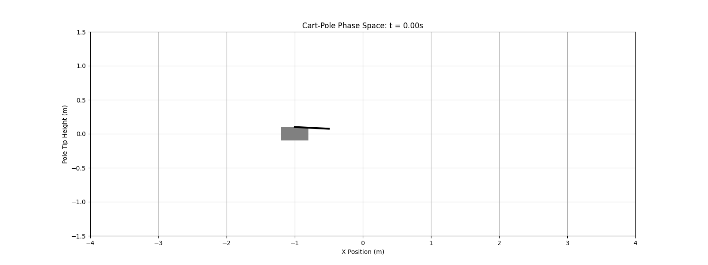
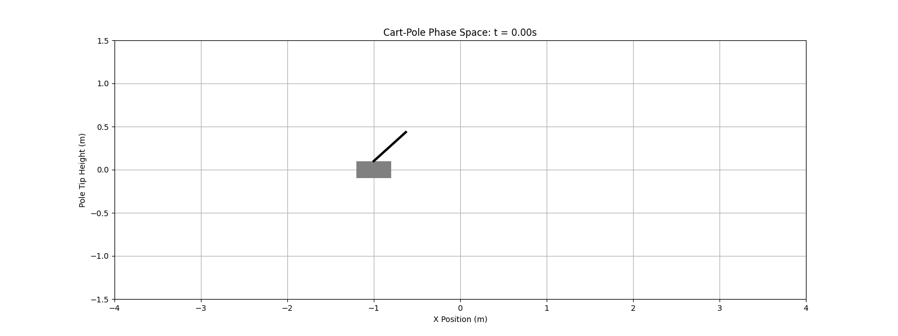
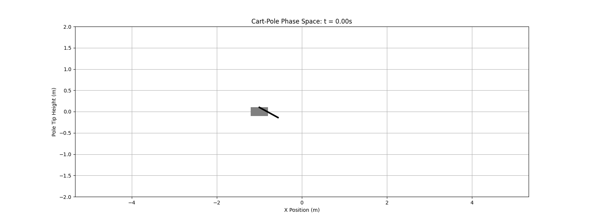
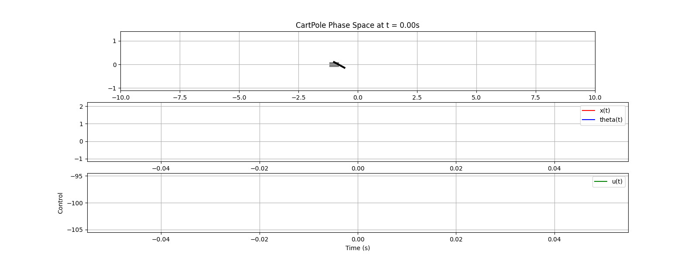
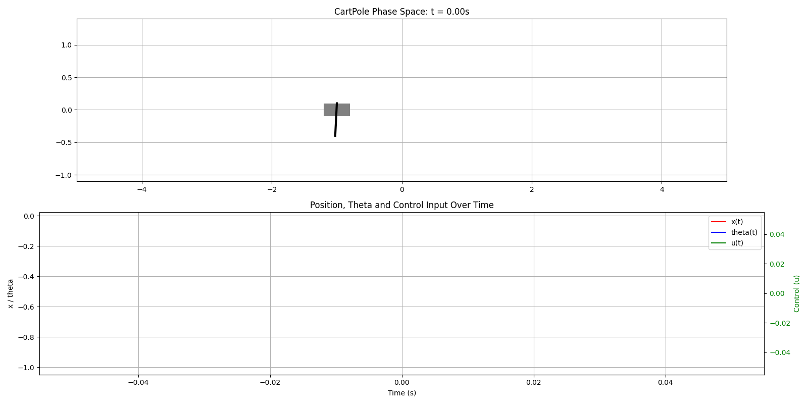

# Compare with PD/PID

Just PD for pole:



> Can flip and hold pole UP.

Added integral + window for theha and it can hold the position also!


From the bottom:





Tuning pd add Integral part to the position and tune koeficient we got realy good result:



# Compare with energy

Up the Pole


# Compare with hybrid (energy + pid)


# Compare MPC_Simple (in descrete form)


# MPC_Montecalro

Work Good! With constrains


```
3334/3334 [01:59<00:00, 27.99it/s]

init_state = np.array([-1, 0.0, np.pi+0.05, 0.0])  # Start nearly hanging downward
# init_state = np.array([-1, 0.0, 0.15, 0.0])  # Start nearly hanging upward
cartpole = CartPole(init_state)

#create controller instance
pd = ControlParams.PDParams(k_theta_p=300.0, k_theta_d=100.0, k_x_p=1.0, k_x_d=-50.0, k_x_i=100, k_x_i_dur=0.2, switch_angle_deg=45.0) # fast stable
energy = ControlParams.EnergyParams(k_energy=15.0)
hybrid = ControlParams.HybridParams(switch_angle_deg=45.0)
mpc_monte = ControlParams.MPCMonteParams(horizon_seconds=1.5, samples=500, x_limit=2, force_step_part=0.01, weight_theta=10000, weight_x=10.0, weight_theta_dot=0.1, weight_x_dot=0.2)
params = ControlParams(pd=pd, energy=energy,hybrid=hybrid, mpc_monte=mpc_monte)

method = "mpc_montecarlo"  # "pd", "energy", "hybrid"
controller = Controller(method=method, params=params)

sim = Simulation(T=10, dt=0.003, frame_numbers=300, label_text=method, mode='gif')
sim.initialize(cartpole, controller)
sim.simulate(wait_time = 0.0)
```