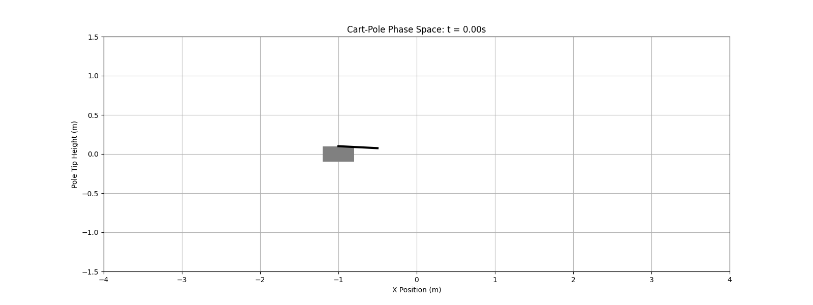
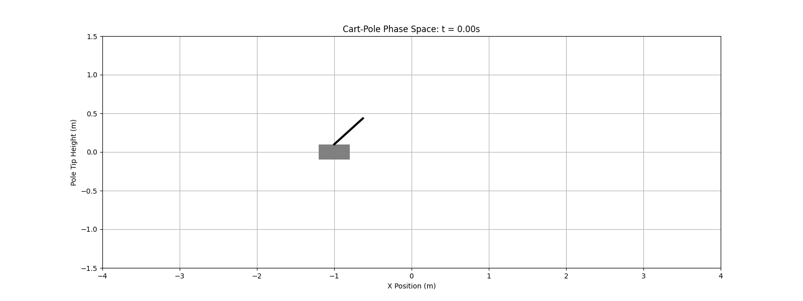
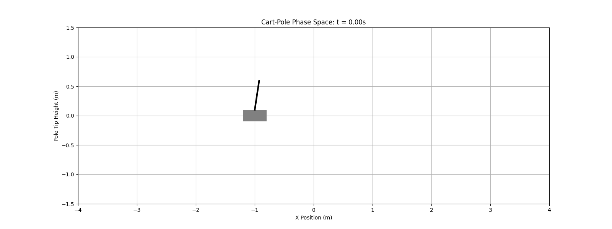
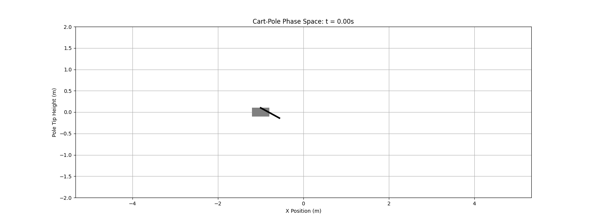
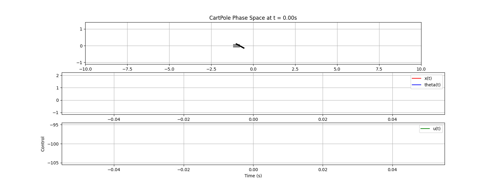
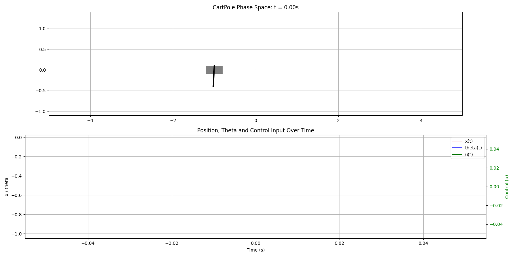
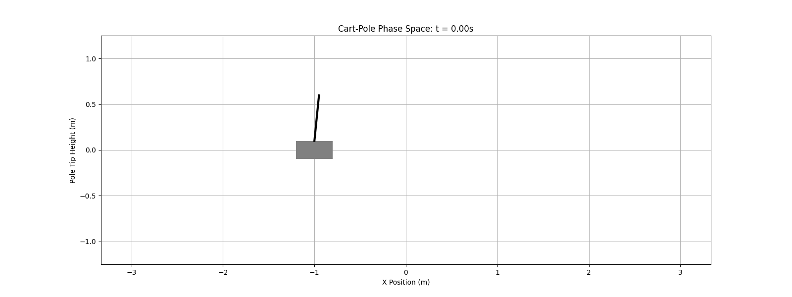

# Compare with PD/PID

Just PD for pole:

> Can flip and hold pole UP.

Added integral + window for theha and it can hold the position also!

From the bottom:

Tuning pd add Integral part to the position and tune koeficient we got realy good result:

# Compare with energy

Up the Pole

# Compare with hybrid (energy + pid)

# Compare MPC_Simple (in descrete form)

