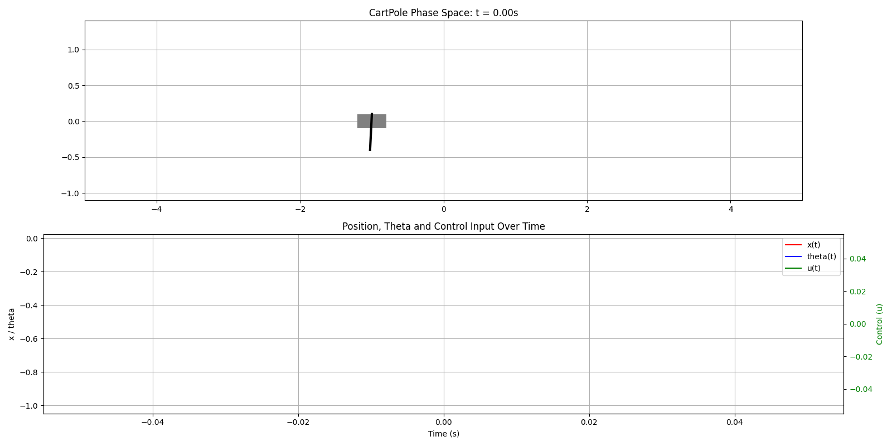

# PD/PID Control

Just PD for pole:

> Can flip (swing-up) with some trick and hold pole UP.

Tuning pd add integral part to the position and tune koeficient we got realy good result:

# Energy Control for swing-up

Up the Pole

# Hybrid Control (energy + pid)

# MPC_Montecalro (horizon is ~0.7s)

Work Good! With constrains

Even in narrow zone $<0.15 m$

# Cart-Pole Controller Comparison

| Feature                        | PID                       | Hybrid (Energy + PID)     | MPC (Monte Carlo)          |
|-------------------------------|---------------------------|----------------------------|-----------------------------|
| **Stabilization Time** (with swing-up) | ~3 s  | ~9 s               | ~4 s                |
| **Max Working Δt**            | ≤ 0.04 s (unstable above)| ≤ 0.1 s Energy part is stable (but PID) | ≤ 0.1 s                |
| **Compute Time (1 step)**     | <0.004 ms                  | <0.004 ms                   | ~4–8 ms (depends on horizon) |
| **Working Space**             | ±1.5 m (uncontrolable)           | ±1 m (less for swing-up)                    | **±0.2 m with constraints**     |

____

MPC montecarlo algorithm

1. **Generate N random control sequences:**
   - u₀ ← initial controls (gausian-random)
   - s ← s₀ x N

2. **For each sequence:**
   a. Initialize s ← s₀
   b. For k = 1 to H:
      - Predict next state: s ← s + Δt · dynamics(s, u)
      - Wrap θ ∈ [−π, π]
      - If |x| > limit: mark sequence invalid
      - Update u ← u + Δu[k]  (kinda like exponential filter)

3. **Compute cost:**
   cost ← weighted sum of squared errors (x, ẋ, θ, θ̇)

4. **Return u₀ of the lowest-cost sequence**

